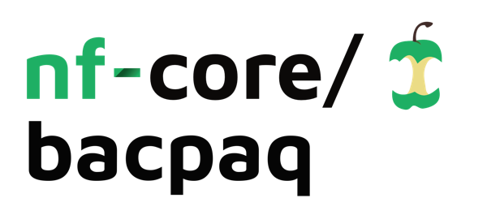

<h1>
  <picture>
    <source media="(prefers-color-scheme: dark)" srcset="docs/images/nf-core-bacpaq_logo_dark.png">
    
  </picture>
</h1>

[](https://github.com/nf-core/bacpaq/actions/workflows/ci.yml)
[](https://github.com/nf-core/bacpaq/actions/workflows/linting.yml)[](https://nf-co.re/bacpaq/results)[](https://doi.org/10.5281/zenodo.XXXXXXX)
[](https://www.nf-test.com)

[](https://www.nextflow.io/)
[](https://docs.conda.io/en/latest/)
[](https://www.docker.com/)
[](https://sylabs.io/docs/)
[](https://tower.nf/launch?pipeline=https://github.com/nf-core/bacpaq)

[](https://nfcore.slack.com/channels/bacpaq)[](https://twitter.com/nf_core)[](https://mstdn.science/@nf_core)[](https://www.youtube.com/c/nf-core)

## Introduction

**`bacpaq`** is a bioinformatics best-practice pipeline for bacterial genomic analysis for short-reads (Illumina) and long-reads (Oxford Nanopore) sequencing data. Currently `bacpaq` supports WGS-based analyses, however, we plan to integrate Microbiome (Amplicon and Shotgun Metagenomics) analyses in future.

`bacpaq` contains two high-level workflows; quality control, and annotation which aare supported by several sub-workflows as described below.

The pipeline is built using [Nextflow](https://www.nextflow.io), a workflow tool to run tasks across multiple compute infrastructures in a very portable manner. It uses Docker/Singularity containers making installation trivial and results highly reproducible. The [Nextflow DSL2](https://www.nextflow.io/docs/latest/dsl2.html) implementation of this pipeline uses one container per process which makes it much easier to maintain and update software dependencies. Where possible, these processes have been submitted to and installed from [nf-core/modules](https://github.com/nf-core/modules) in order to make them available to all nf-core pipelines, and to everyone within the Nextflow community!

On release, automated continuous integration tests run the pipeline on a full-sized dataset on the AWS cloud infrastructure. This ensures that the pipeline runs on AWS, has sensible resource allocation defaults set to run on real-world datasets, and permits the persistent storage of results to benchmark between pipeline releases and other analysis sources.The results obtained from the full-sized test can be viewed on the [nf-core website](https://nf-co.re/seqqc/results).

## Pipeline summary

### Workflows

#### 1. Seqqc

**raw-reads-qc**

This sub-workflow processes raw sequencing reads such that only high-quality reads and/or sequences can be left to ensure the reliability and accuracy of downstream analyses. The sub-workflow works differently depending on the sequencing platform.

For paired-end short reads (specifically Illumina), initially, a set of raw reads are randomly sampled to a specified coverage using [Rasusa](https://github.com/mbhall88/rasusa). For the subsampling, the options `--genome_size`, with the size of reference genome, and `--depth_cut_off`, with the cut off value for read depth, should be given. The subsampled reads get trimmed with one of the trimming tools, which should be specified using the option `--trim_tool`. The available tools include [fastp](https://github.com/OpenGene/fastp), [Trimmomatic](https://github.com/timflutre/trimmomatic), and [Trim Galore](https://github.com/FelixKrueger/TrimGalore). The QC reports for the set of reads before and after trimming are generated using [FastQC](https://github.com/s-andrews/FastQC) and [MultiQC](https://github.com/MultiQC/MultiQC). Additionally, the trimmed reads go under bacterial intra-species contamination using [`ConFindr`](https://github.com/OLC-Bioinformatics/ConFindr). Sub-sampling and contamination detection steps can be skipped using the flags `--skip_subsampling` and `--skip_confindr`, respectively.

For long read sequencing data (specifically Oxford Nanopore), the sub-workflow starts with adaptor trimming employing [Porechop_ABI](https://github.com/bonsai-team/Porechop_ABI). Then, a set of reads are arbitrarily sampled using [Rasusa](https://github.com/mbhall88/rasusa) like in paired-end short reads, as described above. The QC reports for processed reads are produced using [NanoComp](https://github.com/wdecoster/nanocomp) and [pycoQC](https://github.com/a-slide/pycoQC). For the generation of QC reports, summary files generated from Guppy should be given too. All the steps can be skipped using the flags `--skip_porechop`, `--skip_subsampling`, `--skip_quality_report`, and `--skip_pycoqc`.

> The entire raw read QC can be skipped with the flag `--skip_raw_qc`.

**Taxonomy-qc**

The sub-workflow TAXONOMY_QC classifies the input reads (in `.fastq` format) into taxonomic units and performs de-hosting if necessary. By default, aligned and unaligned reads are saved. For taxonomic classification, users can choose between `Kraken2` (default) and `centrifuge` ( `--classifier=“centrifuge”`). This step also created `krona` type plots for taxonomic visualization. De-hosting requires a reference genome to map against, and it can be performed with `minimap2` (default) or `BWA` ( `--dehosting_aligner=“bwa”`). After alignment, it uses `samtools` to separate aligned and unaligned reads.

> The entire taxonomy QC can be skipped with the flag `--skip_taxonomy_qc`. OR dehosting task can be skipped with the flag `--skip_dehosting`

**Assembly**

The Assembly subworkflow performs de novo genome assembly on quality-filtered/trimmed reads produced by the Raw_Reads_QC subworkflow.

For paired-end short reads (specifically Illumina), several assembler options are available, including spades, skesa, megahit, velvet, which can be specified using the option `--sr_assembler`. For long read sequencing data (specifically Oxford Nanopore), [Dragonflye](https://github.com/rpetit3/dragonflye) is the only supported long read assembler at the moment. Error-prone long read genome assemblies can be further polished using [medaka](https://github.com/nanoporetech/medaka) or [racon](https://github.com/isovic/racon) both of which can be repeated multiple times by specifying `--medaka_rounds` or `--racon_rounds`. Set the number of polishing rounds to 0 to disable post-assembly polishing. You can specify medaka models trained on specific basecalling models and sequencing kits for genome polishing using `--medaka_model`.

> Currently, the assembly subworkflow does not support single-end short reads or hybrid assembly

**Assembly-qc**

This sub is designed for quality control of genome assemblies, integrating three main tools: CHECKM, QUAST, and BUSCO. These tools evaluate the quality, completeness, and contamination of genome assemblies. You may skip any of these steps by using options `--skip_checkm`, `--skip_quast` and `--skip_busco`.

#### 2. Annotation

**Gene-prediction**

The Gene-prediction subworkflow predicts and annotates the coding sequences of bacterial genome assemblies using [Prokka](https://github.com/tseemann/prokka) and/or [Bakta](https://github.com/oschwengers/bakta). Bakta requires a database whose path can be specified using the option `--bakta_db`. Otherwise, it will download the database into local storage. Optionally, a pre-trained gene model can be provided using the option --prodigal_training_file. User provided Genbank or Protein FASTA file(s) that you want to annotate genes from can be provided using the option `--annotation_protein_file`. Gene-prediction using both tools are executed by default, which can be disabled using the option, `--skip_prokka` and/or `--skip_bakta`.

**AMR**

The AMR subworkflow identifies AMR genes using [RGI](https://github.com/arpcard/rgi#install-rgi-using-docker-singularity), [AMRFinderPlus](https://github.com/ncbi/amr), [ABRicate](https://github.com/tseemann/abricate), [abriTAMR](https://github.com/MDU-PHL/abritamr), and [Resfinder](https://bitbucket.org/genomicepidemiology/resfinder.git). Both Resfinder and AMRFinderPlus requires a database whose path can be specified using the options `--resfinder_db` or `--amr_finderplus_db` respectively. If not specified, the AMRFinderPlus database will be downloaded locally. Additionally, virulence factors can be identified using ABRicate. The AMR or virulence factor database used with ABRicate can be specified using the option `--abricate_db`. Only one database can be specified at a time. All AMR tools are executed by default, and individual tools can can be disabled using the option `--skip_abricate`, `--skip_amr_annotation`, `--skip_rgi`, `--skip_abritamr`, or `--skip_amrfinderplus`.

**Phage**

The Phage subworkflow classifies input sequences into virus taxonomies using [VirSorter2](https://github.com/jiarong/VirSorter2). If the subworkflow is run for the first time, it downloads database files into local storage. If the database is already stored locally, it can be employed using the option, `--virsorter_db`, while skipping downloading a new one. The virus classification can be skipped with the option, `--skip_phage_annotation`.

**Plasmid**

The Plasmid subworkflow detects and types plasmids present in bacterial genome assemblies using [PlasmidFinder](https://bitbucket.org/genomicepidemiology/plasmidfinder/src/master/) and the MOB-recon tool from [MOB-SUITE](https://github.com/phac-nml/mob-suite) which additionally, can reconstruct individual plasmid sequences. Plasmid analysis using both tools are executed by default, which can be disabled using the option, `--skip_mobsuite` and/or `--skip_plasmidfinder`

**CRISPR**

The CRISPR subworkflow identifies Cas operons, CRISPR arrays and spacer sequences in bacterial genome assemblies using [CRISPRCasTyper](https://github.com/Russel88/CRISPRCasTyper). CRISPR identification is executed by default, which can be disabled using the option, `--skip_crispr`

**Pan-genome analysis**

The Pangenome_analysis subworkflow carries out a pangenome analysis with gene-annotated sequences in GFF3 format using [Roary](https://sanger-pathogens.github.io/Roary) and [PIRATE](https://github.com/SionBayliss/PIRATE). Pangenome analysis using both tools are executed by default, which can be disabled using the option, `--skip_roary` and/or `--skip_pirate`.

## Quick Start

1. Install [`Nextflow`](https://www.nextflow.io/docs/latest/getstarted.html#installation) (`>=22.10.1`)

2. Install any of [`Docker`](https://docs.docker.com/engine/installation/), [`Singularity`](https://www.sylabs.io/guides/3.0/user-guide/) (you can follow [this tutorial](https://singularity-tutorial.github.io/01-installation/)), [`Podman`](https://podman.io/), [`Shifter`](https://nersc.gitlab.io/development/shifter/how-to-use/) or [`Charliecloud`](https://hpc.github.io/charliecloud/) for full pipeline reproducibility _(you can use [`Conda`](https://conda.io/miniconda.html) both to install Nextflow itself and also to manage software within pipelines. Please only use it within pipelines as a last resort; see [docs](https://nf-co.re/usage/configuration#basic-configuration-profiles))_.

3. Download the pipeline and test it on a minimal dataset with a single command:

   ```bash
   nextflow run nf-core/seqqc -profile test,YOURPROFILE --outdir <OUTDIR>
   ```

   Note that some form of configuration will be needed so that Nextflow knows how to fetch the required software. This is usually done in the form of a config profile (`YOURPROFILE` in the example command above). You can chain multiple config profiles in a comma-separated string.

   > - The pipeline comes with config profiles called `docker`, `singularity`, `podman`, `shifter`, `charliecloud` and `conda` which instruct the pipeline to use the named tool for software management. For example, `-profile test,docker`.
   > - Please check [nf-core/configs](https://github.com/nf-core/configs#documentation) to see if a custom config file to run nf-core pipelines already exists for your Institute. If so, you can simply use `-profile <institute>` in your command. This will enable either `docker` or `singularity` and set the appropriate execution settings for your local compute environment.
   > - If you are using `singularity`, please use the [`nf-core download`](https://nf-co.re/tools/#downloading-pipelines-for-offline-use) command to download images first, before running the pipeline. Setting the [`NXF_SINGULARITY_CACHEDIR` or `singularity.cacheDir`](https://www.nextflow.io/docs/latest/singularity.html?#singularity-docker-hub) Nextflow options enables you to store and re-use the images from a central location for future pipeline runs.
   > - If you are using `conda`, it is highly recommended to use the [`NXF_CONDA_CACHEDIR` or `conda.cacheDir`](https://www.nextflow.io/docs/latest/conda.html) settings to store the environments in a central location for future pipeline runs.

4. Start running your own analysis!

```bash
nextflow run main.nf \
   -profile <docker/singularity/.../institute> \
   --input samplesheet.csv \
   --outdir <OUTDIR>
```

> [!WARNING]
> Please provide pipeline parameters via the CLI or Nextflow `-params-file` option. Custom config files including those provided by the `-c` Nextflow option can be used to provide any configuration _**except for parameters**_;
> see [docs](https://nf-co.re/usage/configuration#custom-configuration-files).

For more details and further functionality, please refer to the [usage documentation](https://nf-co.re/bacpaq/usage) and the [parameter documentation](https://nf-co.re/bacpaq/parameters).

## Pipeline output

To see the results of an example test run with a full size dataset refer to the [results](https://nf-co.re/bacpaq/results) tab on the nf-core website pipeline page.
For more details about the output files and reports, please refer to the
[output documentation](https://nf-co.re/bacpaq/output).

## Credits

nf-core/bacpaq was originally written by [CIDGOH](https://cidgoh.ca) genomics group.

## Contributions and Support

If you would like to contribute to this pipeline, please see the [contributing guidelines](.github/CONTRIBUTING.md).

For further information or help, don't hesitate to get in touch on the [Slack `#bacpaq` channel](https://nfcore.slack.com/channels/bacpaq) (you can join with [this invite](https://nf-co.re/join/slack)).

## Citations

An extensive list of references for the tools used by the pipeline can be found in the [`CITATIONS.md`](CITATIONS.md) file.

You can cite the `nf-core` publication as follows:

> **The nf-core framework for community-curated bioinformatics pipelines.**
>
> Philip Ewels, Alexander Peltzer, Sven Fillinger, Harshil Patel, Johannes Alneberg, Andreas Wilm, Maxime Ulysse Garcia, Paolo Di Tommaso & Sven Nahnsen.
>
> _Nat Biotechnol._ 2020 Feb 13. doi: [10.1038/s41587-020-0439-x](https://dx.doi.org/10.1038/s41587-020-0439-x).
